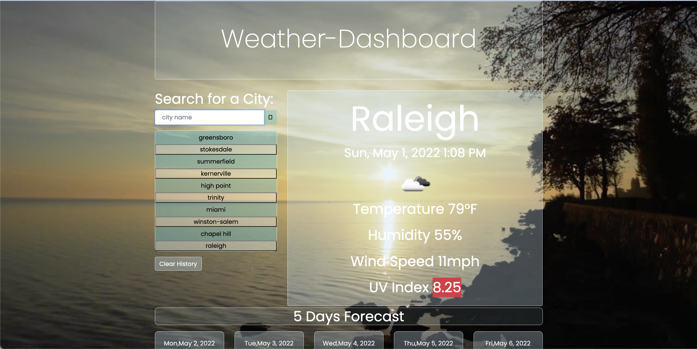

# weatherapp

<h1 align="center">🌦5 Day Weather Forecast</h1>
<h2 align="center">By: Gabrielle Befort</h2>

Created a dashboard that uses [OpenWeather API](https://openweathermap.org/api) to retrieve weather data. Type any location and see the weather anywhere. This uses `localStorage` to save any cities you searched for. 

**Deployed website: https://mrsbefort.github.io/weatherapp/**

The following images demonstrates the application functionality: 




## User Story
```
AS A traveler 🛩
I WANT to see the weather outlook for multiple cities
SO THAT I can plan a trip accordingly
```

## Acceptance Criteria

```
GIVEN a weather dashboard with form inputs
WHEN I search for a city
THEN I am presented with current and future conditions for that city and that city is added to the search history
WHEN I view current weather conditions for that city
THEN I am presented with the city name, the date, an icon representation of weather conditions, the temperature, the humidity, the wind speed, and the UV index
WHEN I view the UV index
THEN I am presented with a color that indicates whether the conditions are favorable, moderate, or severe
WHEN I view future weather conditions for that city
THEN I am presented with a 5-day forecast that displays the date, an icon representation of weather conditions, the temperature, the wind speed, and the humidity
WHEN I click on a city in the search history
THEN I am again presented with current and future conditions for that city
```


## Reference websites used to learn: 

In this challenge I spent some time learning how to style while using bootstrap. Particularly with changing text colors and adding opacity/transparent to background colors, which I liked. I also tried to continue learning the hidden feature and implementing it to hide the saved cities until used in my code. I had my first experience with adding videos to my background, which I found how to do using a quick google search. 

https://www.videvo.net/ 

https://getbootstrap.com/ 

https://www.w3schools.com/howto/howto_css_fullscreen_video.asp 

https://openweathermap.org/api/one-call-api 
